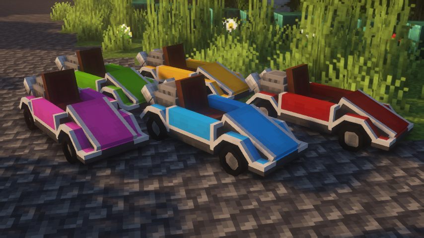
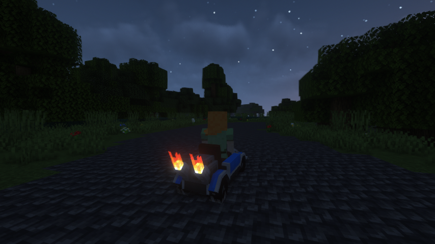

# Automobility
A Minecraft vehicle mod adding customizable cars.   

### Screenshots
  
  

### Try it out!
Recommended to use along with [LambdaControls](https://www.curseforge.com/minecraft/mc-mods/lambdacontrols), which allows for controller support when driving an automobile. (Already loaded when using in dev environment)
  
There are no official releases yet.  
#### If you would like to try it out:
**Option A:** Clone the repository and run the game in the dev environment.  
**Option B:** Download a GitHub Actions artifact from this repository, and use the jar not suffixed with `dev` or `sources`.  
 
To get an automobile in game, construct it on an Automobile Assembler using a frame, engine, and four wheels. *Features are not obtainable in survival.*  
 
**Driving with Keyboard/Mouse:**
- W - Accelerate
- S - Brake/Reverse
- A/D - Steer left/right
- Space - Drift

**Driving with Controller (LambdaControls):**
- A - Accelerate
- B - Brake/Reverse
- LStick - Steer left/right
- RTrigger - Drift

### Credit: Audio
All sound effects used (originals licensed under CC0) from [freesound.org](https://freesound.org/):  
- [ENGINE~1.WAV](https://freesound.org/people/MarlonHJ/sounds/242739/) *by MarlonHJ*  
- [Marine diesel engine](https://freesound.org/people/AugustSandberg/sounds/264864/) *by AugustSandberg*  
- [metal_ring_01.wav](https://freesound.org/people/Department64/sounds/95272/) *by Department64*  
- [metalbang0.wav](https://freesound.org/people/SamsterBirdies/sounds/435699/) *by SamsterBirdies*  
- [Hollow Bang](https://freesound.org/people/qubodup/sounds/157609/) *by qubodup*  
- [car park skiding corner.wav](https://freesound.org/people/martian/sounds/178889/) *by martian*  