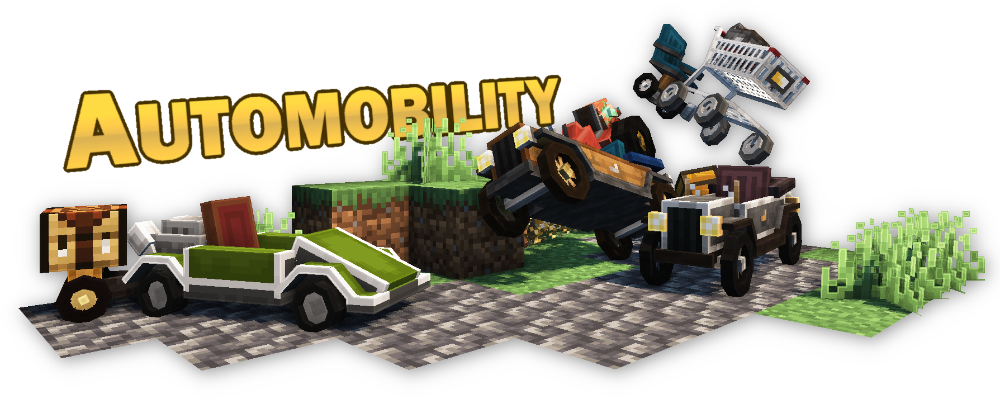
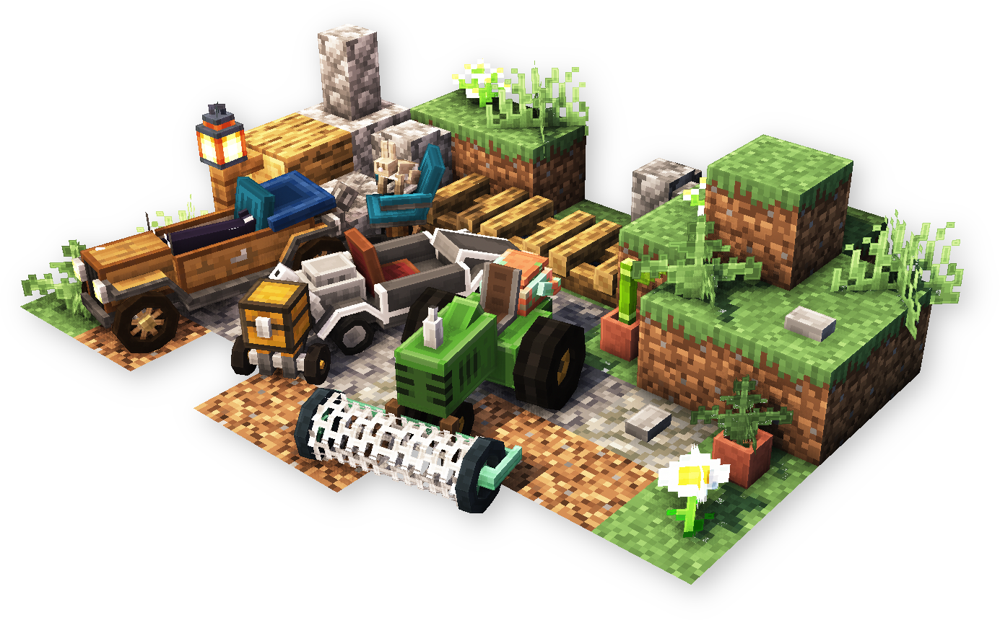
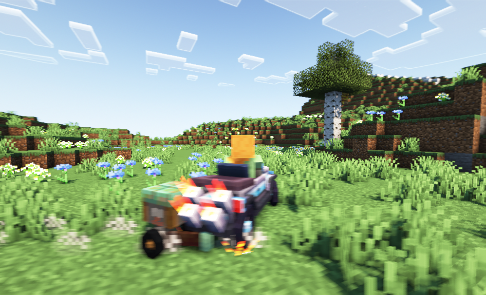

### A Minecraft mod adding customizable vehicles.

## Available for Fabric/Quilt
- Requires **[Fabric API](https://modrinth.com/mod/fabric-api)** (Fabric) or **[QSL](https://modrinth.com/mod/qsl)** (Quilt)

**Support for Forge or old versions is NOT PLANNED.**

## Getting Started
- **Recipes:** Crafting recipes can be viewed using [**EMI**](https://www.curseforge.com/minecraft/mc-mods/emi).
- **Automobile Parts:** Craft an Auto Mechanic Table. Use the GUI to craft the frame, engine, and wheels for your automobile. You can optionally craft an attachment.
- **Building your Automobile:** Craft an Automobile Assembler, as well as a Crowbar. Place parts on the assembler until the vehicle is complete. Use a crowbar to destroy the vehicle. After building, add your attachments.

## Driving
- W - Accelerate
- S - Brake/Reverse/Burnout
- A/D - Steer left/right
- Space - Drift

**Controller Support:** when using [MidnightControls](https://www.curseforge.com/minecraft/mc-mods/midnightcontrols), you will be able to control automobiles with the following default controls:
- A - Accelerate
- B - Brake/Reverse
- LStick - Steer left/right
- RTrigger - Drift

### Credit: Audio
All sound effects used (originals licensed under CC0) from [freesound.org](https://freesound.org/):  
- [ENGINE~1.WAV](https://freesound.org/people/MarlonHJ/sounds/242739/) *by MarlonHJ*  
- [Marine diesel engine](https://freesound.org/people/AugustSandberg/sounds/264864/) *by AugustSandberg*  
- [metal_ring_01.wav](https://freesound.org/people/Department64/sounds/95272/) *by Department64*  
- [metalbang0.wav](https://freesound.org/people/SamsterBirdies/sounds/435699/) *by SamsterBirdies*  
- [Hollow Bang](https://freesound.org/people/qubodup/sounds/157609/) *by qubodup*  
- [car park skiding corner.wav](https://freesound.org/people/martian/sounds/178889/) *by martian*  