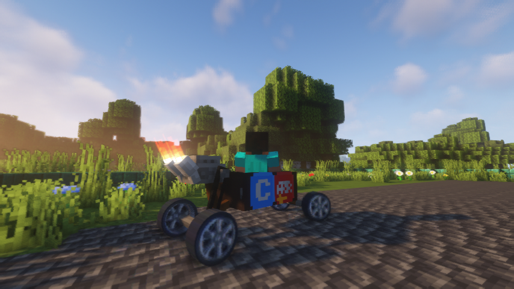

# Automobility
A Minecraft vehicle mod adding customizable cars.   
Made for ModFest 1.17

### Screenshots
  
  
  
  
  

### Try it out!
Recommended to use along with [LambdaControls](https://www.curseforge.com/minecraft/mc-mods/lambdacontrols), which allows for controller support when driving an automobile. (Already loaded when using in dev environment)
  
There are no official releases yet.  
#### If you would like to try it out:
**Option A:** Clone the repository and run the game in the dev environment.  
**Option B:** Download a GitHub Actions artifact from this repository, and use the jar not suffixed with `dev` or `sources`.  
 
To get an automobile in game, summon one in with `/summon automobility:automobile`. You will need to edit its NBT to change the frame or wheels.  
 
**Driving with Keyboard/Mouse:**
- W - Accelerate
- S - Brake/Reverse
- A/D - Steer left/right
- Space - Drift

**Driving with Controller (LambdaControls):**
- A - Accelerate
- B - Brake/Reverse
- LStick - Steer left/right
- RTrigger - Drift
